# 异步操作系统 AsyncOS 的虚拟化设计方案

- AsyncOS
- 设计方案
- 虚拟化
- 文档

## 事由

在计算机虚拟化技术中，虚拟化通常分为三大核心子系统：

1. CPU 虚拟化
2. 内存虚拟化
3. IO 及设备虚拟化

操作系统内核中的多任务调度和虚拟地址等概念已经是对 CPU 虚拟化和内存虚拟化的诠释，借助目前很多成熟的软件/硬件虚拟化的技术可以解决 CPU 虚拟化和内存虚拟化中的问题。本文档描述在异步操作系统中增加了虚拟化的相关设计方案，从 IO 及设备虚拟化切入，直观思路是：

- 把物理设备也视为异步操作系统中的不断执行固定逻辑的任务；
- 把设备虚拟化视为物理设备与处于不同内核，不同特权级的 "虚拟设备任务" 之间的映射关系；
- 这些 "虚拟设备任务" 与物理设备进行交互；
- 基于 "虚拟设备任务" 这个概念， 处于 CPU 之外的设备与在 CPU 上运行的软件任务可以统一起来；
- CPU 上的任务与设备之间的通信则可以视为普通任务与 "虚拟设备任务" 之间的事件通知。

现在想把异步操作系统的范围拓展到多内核支持， 即在一个操作系统内针对任务的不同需求，分别采用实时调度、公平调度和协作调度；进而，把虚拟机监控器的多内核调度纳入一个统一的调度框架。最美好的图景是，操作系统在启动时只有最小系统处于工作状态；然后依据应用需要的服务类型和使用服务的时间，动态加载和卸载对应的一个或多个传统意义下的内核服务。

这个图景对的操作系统内核结构是：

- 一个基于微内核的最小运行时框架，一组支持热升级的用安全 Rust 编写的内核组件；
- 在操作系统统一管理下，所有任务（执行流）执行环境构成一个具有嵌套关系的任务上下文构成的树状结构；
- 设备抽象成可以被映射到多个任务上下文的特殊任务，即虚拟设备；
- 所有通信机制都抽象成事件通知；
- 调度器是可以在所有任务执行环境中执行的实现任务切换功能的代码片段（所有任务的组成部分）；
- 任务切换时的上下文保存和恢复是指，当前任务与下一个执行任务的差异部分的保存和恢复。


## 设计方案总览

AsyncOS 把 CPU 上的执行流，CPU 之外的物理设备，以及位于不同特权级上的设备虚拟化中介，统统归入这个抽象。所有跨任务的通信通过统一的 "事件通知" 机制完成。 整体的概念关系如下图所示。

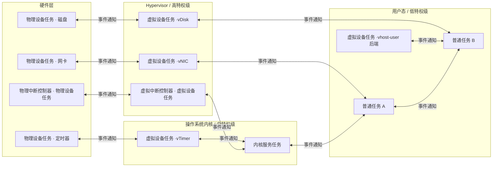

图中的关键点：

- 所有节点都是 "任务"，只是执行环境不同；
- 物理设备任务指的是硬件电路本身（不占用 CPU）的运行逻辑，只有需要 CPU 参与的部分（如驱动的中断处理，DMA 完成后的清理）才会以任务形式在 CPU 上运行；
- 虚拟设备任务则运行在 CPU 上，通常位于比其使用者更高的特权级，但也可能位于用户态（如 vhost-user 场景）；
- 任意两个任务之间的箭头都表示 "事件通知"，它可能是异步的（发送方不等待），也可能是同步的（发送方等待响应）。


## 核心概念定义

### 任务

每个具有独立信息处理功能的执行流（代码序列）在一个数据集合上执行过程，构成任务。

任务可以视为传统操作系统中进程、线程和协程的统一抽象。在 AsyncOS 里，它还进一步包括了 "物理设备" 和 "虚拟设备中介"。

| 类别 | 执行环境 | 是否占用 CPU | 典型例子 |
|------|-----------|--------------|----------|
| 物理设备任务 | 设备硬件电路 | 否（硬件自洽） | 网卡， 磁盘， 物理中断控制器 |
| 虚拟设备任务 | CPU 上的某个特权级 | 是（被调度时） | vNIC，vDisk，vIC，vTimer |
| 普通任务 | CPU hypervisor态/内核态/用户态 | 是 | 进程、线程、协程 |

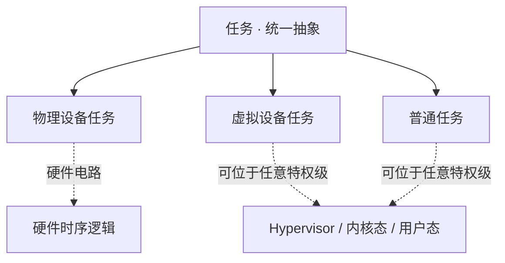

#### 任务状态

执行过程中的任务可能处于下面五种状态。

- 创建： 建立任务执行环境， 分配所需内存等资源；
- 退出： 回收任务占用资源；
- 就绪： 等待分配 CPU， 以执行任务功能；
- 运行： 正占用 CPU 执行任务功能；
- 等待： 等待事件通知。

物理设备任务是指硬件电路的逻辑，它在概念上恒处于 "执行" 状态； 它对应的软件侧任务（例如中断处理协程，DMA 完成清理协程）才会在 "就绪/运行/等待" 之间迁移。

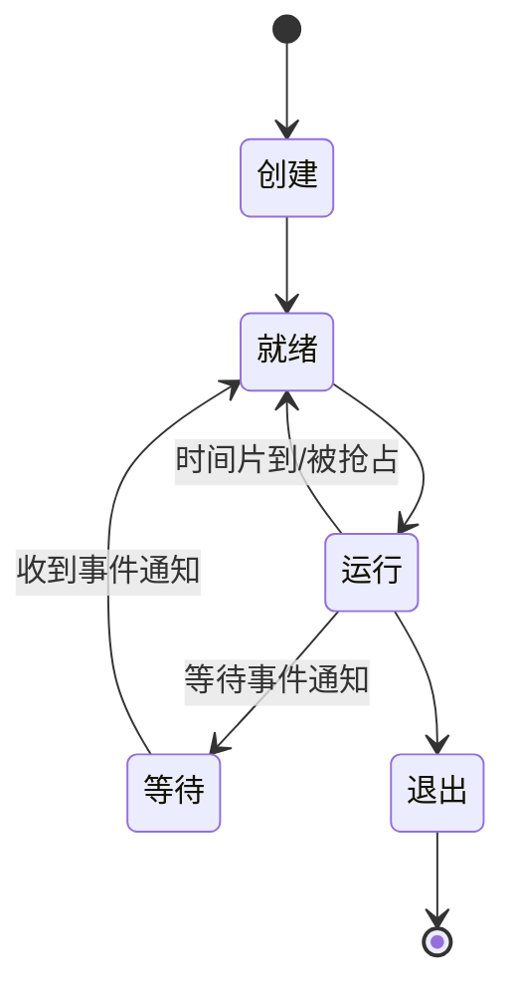

### 任务上下文

任务执行过程会修改数据集中数据状态，数据集中的当前数据状态（地址空间、特权级、函数调用栈、CPU 寄存器等）构成任务上下文。任务上下文和任务占用资源共同构成任务执行环境。

#### 任务标识

每个处于生命周期内的任务具有一个唯一且不同的任务标识。任务标识采用数值化的多级 ID，形式为：

```
TaskId = <os_id, process_id, task_id>
```

其中：

- `os_id`：任务所属的操作系统实例编号；在虚拟化场景中，宿主 OS 与每个 Guest OS 都各占据一个 `os_id`，因此不需要再单独引入 `vm_id`；
- `process_id`：进程/地址空间编号；
- `task_id`：进程内的线程/协程编号。

任务间的从属关系用任务标识的共享前缀表达：

- 同一操作系统的所有任务共享相同的 `os_id`；
- 同一进程的所有线程/协程共享相同的 `<os_id, process_id>`。

这样就得到了一棵以 `os_id` 为根， 以 `<os_id, process_id>` 为中间层， 以 `<os_id, process_id, task_id>` 为叶子的任务树。

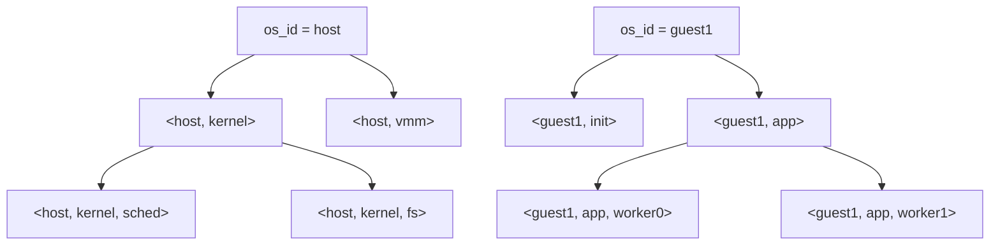

这个树状结构在两处直接被用到：

1. 事件路由：当事件通知的目标不在线时，沿着任务标识前缀往上找一个在线的祖先任务代其处理（详见 "中断链路" 一节）。
2. 上下文差量保存：任务切换时只需保存/恢复两个任务标识的最长公共前缀之外的上下文差异部分。

#### 任务上下文的嵌套结构

现代 CPU 通常都依据可执行的特权指令和内存访问范围分成多种不同特权级。特权级的高低大致可以理解为特权指令能力和内存访问范围的逐渐缩小。

任务上下文完整描述了任务的执行环境。不同任务的上下文在地址空间、特权级、函数调用栈等属性上具有相似性。利用任务上下文的这种相似性，可减少任务上下文占用的存储空间，提高任务切换时上下文保存和恢复速度。

具体地，任务上下文按 "相似性" 由外到内分层：

| 层级 | 共享内容 | 对应任务标识前缀 |
|------|----------|------------------|
| 操作系统级 | 二阶段页表， Guest 物理内存映射 | `os_id` |
| 进程级 | 一阶段页表， 地址空间， 特权级 | `<os_id, process_id>` |
| 线程级 | 函数调用栈， TLS | `<os_id, process_id, task_id>` |
| 协程级 | 只需保存指令指针和少量寄存器 | 同上 |

### 物理设备

物理设备是一类特殊任务，是设备内部的硬件电路 ---- 按固定逻辑不间断执行，不占用任何 CPU 时间。操作系统内核只是把它建模为任务，用统一的接口描述它对外的通信能力。

需要 CPU 参与的部分 ---- 例如中断处理下半部，DMA 完成后的清理，驱动初始化 ---- 则是运行在 CPU 上的普通任务，与物理设备（硬件电路）通过事件通知交互。

#### 设备接口

一个物理设备任务对外暴露：

- 一组用于控制设备和获取设备信息的 I/O 端口（含 MMIO）；
- 一个或多个 中断线；
- 可选的 DMA 通道。


在 AsyncOS 的事件通知模型里：

- 任务通过端口访问 → 相当于向设备发送一个（通常同步的）事件通知；
- 设备通过中断 → 向指定任务发送一个（异步的）事件通知；
- 设备通过 DMA 通道 → 向指定任务的内存区域投递数据，也是一种事件通知。

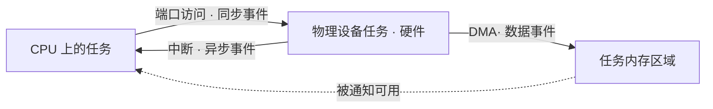

#### 中断控制器

中断控制器本身也是一个物理设备任务。 它负责：

- 汇聚各设备的中断请求；
- 区分中断源；
- 将中断路由到指定的 CPU/特权级/任务。

CPU 通过端口访问与中断控制器交互；设备通过中断线与中断控制器交互。

### 虚拟设备任务

虚拟设备任务是物理设备任务的一个 "影像" ---- 它拥有独立的任务标识，但在语义上代表某个物理设备的一部分或全部能力。它可以被映射到不同任务上下文中，从而让物理设备被多个使用者共享，同时保持每个使用者 "看起来像在独占一个物理设备"。

虚拟设备任务的运行于 CPU 上， 可能位于任意特权级：

- Hypervisor 态：跨 Guest 复用一个物理设备（如 vNIC 复用 pNIC）；
- 内核态：为多个用户进程复用一个物理设备（如共享定时器 vTimer）；
- 用户态：例如 vhost-user，SPDK 这类由用户态进程实现的设备后端。

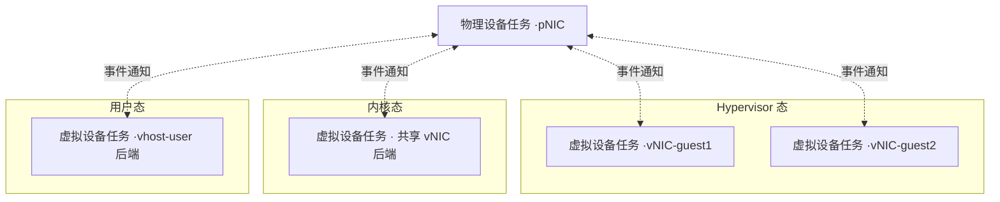

#### 虚拟设备的使用方式

虚拟机中的设备会有两种使用方法：

- 直通设备：只让一个虚拟机使用该设备。hypervisor 需维护设备与虚拟机的映射关系；
- 共享设备：让多个虚拟机复用该设备。hypervisor 需协调对同一物理设备的使用避免冲突，语义上保持与使用物理设备一致。

虚拟设备任务是共享设备的一种实现方式：它对上游暴露一组虚拟的设备接口，对下游与物理设备驱动（物理设备任务）通信，在中间协调多个使用者的语义一致性。

虚拟设备任务的具体实现可以：

- 软件实现：在设备驱动中支持虚拟化；
- 硬件实现：在设备内部（软件或硬件）支持虚拟化，操作系统内核看到的是直通设备（如 SR-IOV）；
- 软硬协同方式：基本的虚拟化功能由硬件实现以提升性能，复杂的虚拟化功能由软件实现以降低硬件开发难度。

#### 虚拟中断控制器

虚拟中断控制器（vIC）是最重要的一类虚拟设备任务。它连接虚拟设备任务与其使用者，把 "虚拟中断" 路由到目标任务。

现代 CPU 中的中断控制器提供了一定的虚拟化功能。AsyncOS 的思路是充分利用中断控制器硬件提供的虚拟化功能来实现功能完善的虚拟中断控制器，使得指定特权级的任务可以把虚拟中断控制器视为直通设备来使用。

### 普通任务

普通任务是不承担设备虚拟化中介职责的任务 ---- 它只是应用逻辑或内核逻辑本身。普通任务通过事件通知与虚拟设备任务交互，从而间接使用物理设备的能力。普通任务对下面这件事是无感知的：它面对的到底是一个虚拟设备任务，还是一个直通的物理设备任务。

## 通信模型

AsyncOS 把所有跨任务通信都统一为 "事件通知"。

### 事件通知（统一抽象）

事件通知是任意两个任务之间的通信原语。一个事件通知包含：

- 来源任务标识；
- 目标任务标识（或其前缀，用于路由到某一层次的任意可达任务）；
- 事件类型/编号；
- 携带数据（可小可大，大数据一般通过共享内存/DMA 传递引用）；
- 同步/异步语义标记。

事件通知在软件层面可能有多种载体，并存于同一个操作系统内：

- 共享内存 + Waker 机制：类似 Rust 的 `Waker`，同特权级，同地址空间任务之间成本最低；
- 软件事件队列/邮箱：跨特权级，跨地址空间的软件 IPC；
- 硬件中断/硬件消息：物理设备到 CPU，CPU 到 CPU（IPI），硬件辅助的 vIRQ 注入。

从上层看，这些载体统一呈现为 `async/await` 接口；但并非所有事件都是异步的 ---- 系统调用，异常，同步 IPC 都是 "事件通知" 的同步变体：发送方等待目标任务处理完成并返回结果。

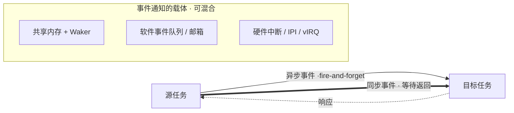

事件通知归类：

| 通信路径 | 传统概念 | 在 AsyncOS 中的表达 | 常见语义 |
|----------|----------|----------------------|----------|
| 设备 → 任务 | 中断/DMA | 事件通知 | 异步 |
| 任务 → 更高特权级任务 | 系统调用 / 异常 | 事件通知 | 同步为主 |
| 同层任务 ↔ 同层任务 | IPC/进程内通信 | 事件通知 | 同步或异步 |

### 中断链路（两跳模型）

物理设备产生中断，最终被 CPU 上的某个普通任务处理，在 AsyncOS 中被建模为两跳事件通知：

1. 第一跳：物理设备任务 → 虚拟设备任务。由物理中断控制器（也是物理设备任务）配合硬件辅助 → 虚拟中断控制器（虚拟设备任务）完成路由。
2. 第二跳：虚拟设备任务 → 普通任务。由虚拟中断控制器把虚拟中断注入到目标任务所处的特权级，唤醒目标任务。

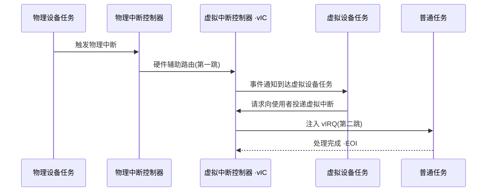

当目标普通任务不在线时，AsyncOS 利用任务标识的树状前缀结构进行逐级回退：

- 若 `<os_id, process_id, task_id>` 不在线 → 交给 `<os_id, process_id>` 层的默认处理任务；
- 若 `<os_id, process_id>` 仍不在线 → 交给 `<os_id>` 层的默认处理任务；
- 依此类推，直至找到一个在线的祖先任务代为处理（例如把中断挂起，记录到目标任务的事件队列，待其被调度时消费）。

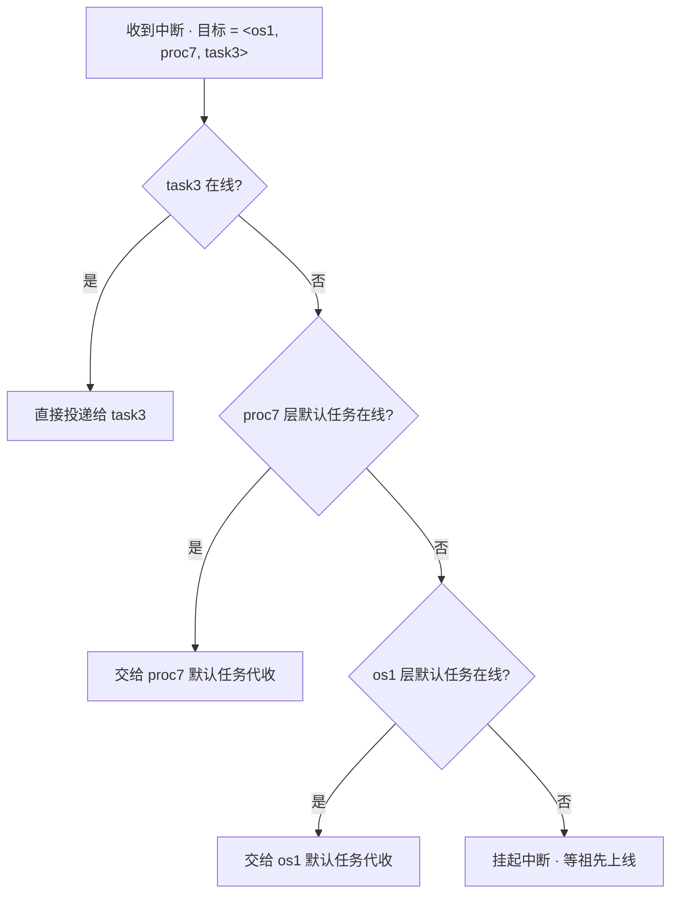

### 普通任务 ↔ 虚拟设备任务的交互

普通任务访问虚拟设备任务有两种并存的方式：

- 兼容方式（虚拟 I/O 端口）：普通任务像访问物理设备一样访问虚拟的 I/O 端口，虚拟设备任务捕获这些端口访问并进行模拟处理。对遗留驱动完全透明。
- 原生方式（`async/await` 调用）：普通任务通过 `vdev.op().await` 直接以异步语义调用虚拟设备任务，底层翻译为事件通知。对新代码更高效，更自然。


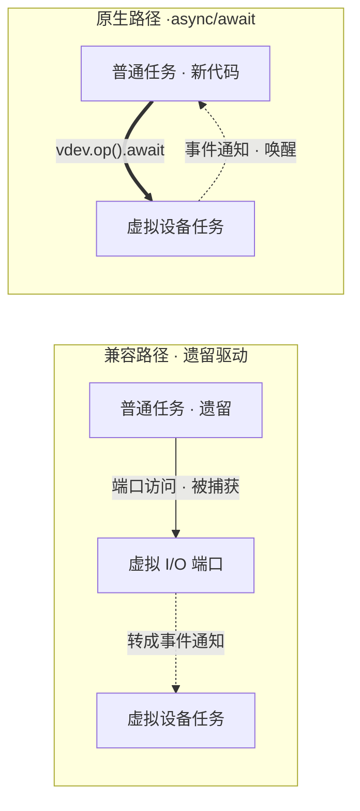

### DMA 建模

DMA 在虚拟设备任务上被统一建模为 "虚拟设备任务向普通任务的内存区域投递数据" 这一事件通知。一次完整的 DMA 交互被拆解为三次事件通知：

1. 普通任务 → 虚拟设备任务：注册 DMA 缓冲区（地址，长度，访问权限），语义为同步事件；
2. 物理设备任务 → 虚拟设备任务：数据准备完成的中断（异步事件）；虚拟设备任务据此把数据（必要时）搬运/翻译到普通任务的缓冲区，或直接透传硬件 DMA 的目标地址（借助 IOMMU / 二阶段翻译）；
3. 虚拟设备任务 → 普通任务：数据可用事件（异步事件），唤醒普通任务处理数据。

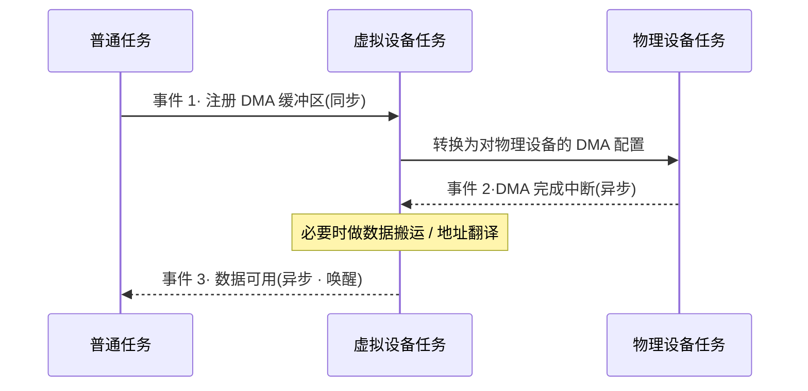

### 同步事件 vs 异步事件

事件通知既支持异步语义， 也支持同步语义，选择依据是 "发送方是否需要等待处理结果"：

| 场景 | 语义 | 底层实现示例 |
|------|------|--------------|
| 中断，DMA 完成，消息投递 | 异步 | 硬件中断 + Waker |
| 同步系统调用，异常，同步 IPC | 同步 | 特权级切换 + 直接返回 |
| `async/await` 上的 `.await` | 语法同步·执行异步 | 挂起当前任务，事件到达后唤醒 |

## 调度器

调度器是以共享内存和软硬协同方式存在于所有任务地址空间，可以在所有任务执行环境中执行的任务切换代码片段（所有任务的组成部分）。

- 中断，异常和系统调用导致的任务切换：硬件保存和恢复部分任务上下文，软件保存和恢复另外的任务上下文；
- 等待事件通知导致的任务切换：完全由软件完成，是当前任务的主动让权。

利用两个相邻任务上下文的相似性（任务标识共享的前缀越长，需要保存/恢复的内容越少），可以显著优化任务切换性能。


## 任务切换

任务切换时的上下文保存和恢复是指：当前任务与下一个执行任务的差异部分的保存和恢复。差异部分由两个任务标识的最长公共前缀决定。

下面是几种典型的任务切换场景。

- 相同地址空间和特权级的协程切换：复用相同地址空间和相同函数调用栈，只通过软件方法切换当前指令指针；
- 相同地址空间和特权级的线程切换：复用相同地址空间，切换函数调用栈，只通过软件方法切换当前指令指针；
- 进程切换：切换地址空间，多次切换特权级，切换函数调用栈，只通过软件方法切换当前指令指针；
- 虚拟机切换：不同虚拟机间的任务切换，需要保存和恢复的任务上下文是最长的；


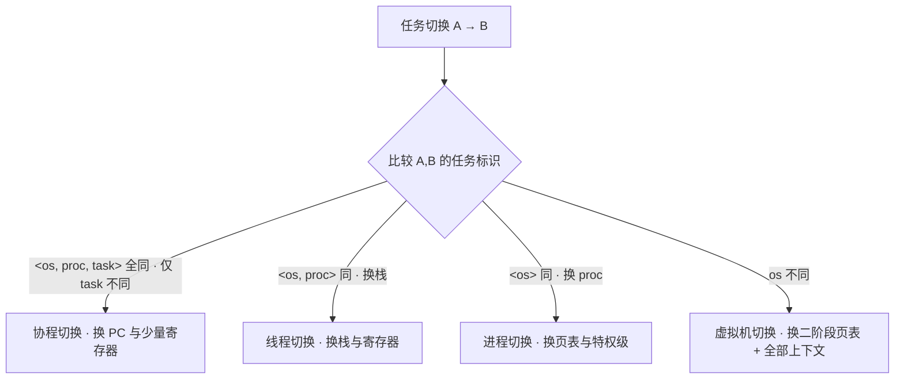

## 实现路径

在这个图景下，这些关于操作系统内核的设计可以用软件，硬件或软硬协同的三种方式来实现。其中 "设备通过中断向指定任务发送事件通知" 是异步操作系统需要实现的核心机制。这涉及到以下两方面：

1. 中断的委托机制：决定了某个中断由哪个特权级来进行处理。
2. 中断的响应方法：影响异步操作系统的性能。

当中断委托到用户态进行处理时，很可能用户态的任务不处于在线的状态。基于任务标识的设计，在处理中断的用户态任务不处于在线状态时，可以依据任务标识，找到该任务所属的父级任务，由父级任务进行处理，同理类推，若父级任务仍处于不在线的状态，仍然可以找到爷爷级任务进行处理。

在中断的响应方法上，当物理设备产生中断时，传统的做法是中断控制器打断 CPU，由 CPU 进行处理，CPU 的处理过程中往往涉及到任务调度。在集成任务调度的中断控制器设计专利中描述了一种中断控制器能够直接处理中断，减少 CPU 被打断的次数，这种中断控制器可以提高操作系统的异步处理能力，它可能的实现路径如下：

1. 模拟硬件设计的软件实现：在模拟器中以设备的形式来实现；
2. 在 FPGA 上实现；
3. 在真实系统中占用一个 CPU；
4. 流片；

其中在 "真实系统中占用一个 CPU" 的实现方式是为了解决在 FPGA 上实现的实验数据结果说服力不高的困境。但该专利还需要解决一个问题就是在真实的系统上，任务的数量级往往远大于 CPU 的数量级，在中断控制器中，通过大量的寄存器来存储任务标识将会占用很多的资源。考虑到在任务为协程的情况下，运行栈与任务是分离的，若干个协程任务可以共享同一个运行栈，只有当协程任务在执行中被打断时，协程任务才会与运行栈绑定成为线程任务。因此，运行栈的数量是与 CPU 的数量处于相同的数量级，如果将中断控制器中的唤醒机制与运行栈进行结合起来，就可以大幅减少寄存器的使用，从而解决资源的问题。

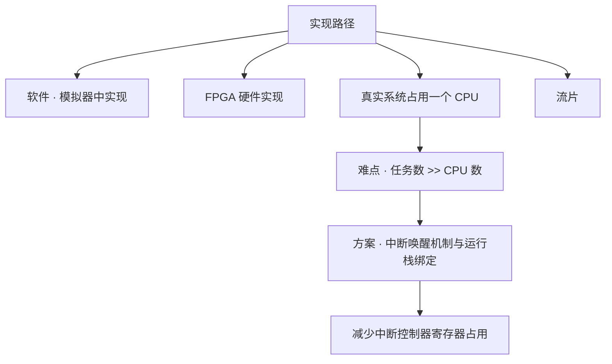

## 虚拟定时器的设计

### 物理定时器

1. 维护一个计数器，每个时钟周期自动加一；
2. 维护一个比较寄存器，在比较寄存器值大于当前计数器值时，触发定时器中断；

### 虚拟定时器

在物理定时器功能的基础上，增加如下逻辑。这个逻辑可以用软件或硬件来实现。

1. 在指定任务执行环境中映射计数器和比较寄存器，在限制的执行环境中设备外部行为与物理定时器相同；
2. 维护一个比较寄存器和任务标识对的队列，按比较寄存器值排队（下面简称定时器队列）；
3. 队首元素中的比较寄存器值，写入物理的比较寄存器；
4. 物理的比较寄存器值大于当前计数器值时，触发虚拟定时器设备任务到指定任务标识的中断（事件通知）；
5. 删除过期的队首元素，并把新队首元素中的比较寄存器值，写入物理的比较寄存器；

如果在多个任务执行环境中映射同一套计数器和比较寄存器，且各自维护一个定时器队列，那么会出现并发访问的问题：

假设 OS_A 维护了一个队列 A，OS_B 维护了一个队列 B，当前物理比较寄存器的值为 5，A 队列的队首任务的比较寄存器的值为 10，B 队列的队首任务的比较寄存器值为 20 时。此时，OS_B 先向物理寄存器写了 20，这个时候，A 再去修改物理的比较寄存器的值为 10 时，会覆盖掉 20 对应的 OS_B 的时钟中断，并且 OS_A 并不知道还有另一个 OS_B 也需要时钟中断，OS_A 无法弥补这个错误。

因此，多个任务执行环境如果要映射同一套计数器和比较寄存器时，那么维护的定时器队列应该是一个全局队列，这个全局队列可以在硬件中进行维护，也可以在软件中进行维护。

如果要在各自的执行环境中各自维护定时器队列的话，那么硬件中至少要维护一个全局队列，队列的容量应该 ≧ 执行环境的数量。
